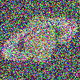

# genetic-art
This program uses a genetic algorithm to recreate the image provided.

Saturne by F. Meheux (Resized to 100x100)
Original | Recreated 
:-------------------------:|:-------------------------:
   |  


## Use
```zsh
cargo run --release --image (IMAGE_PATH) [-v *Up to 3 v's]
```

## Example config.toml
```toml
generations = 10000
population_count = 500
elite_count = 50
crossover_probability = 0.7
mutation_probability = 0.10
[resize_dimensions]
x = 100
y = 100
```

